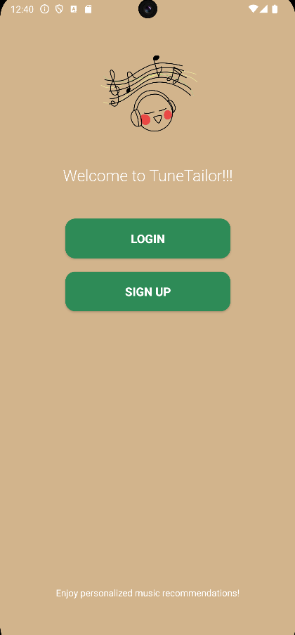
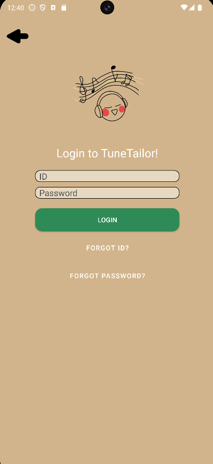
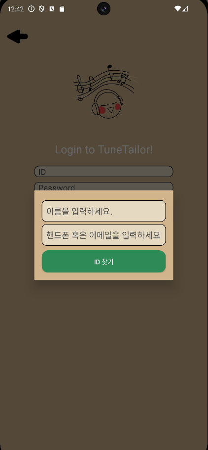
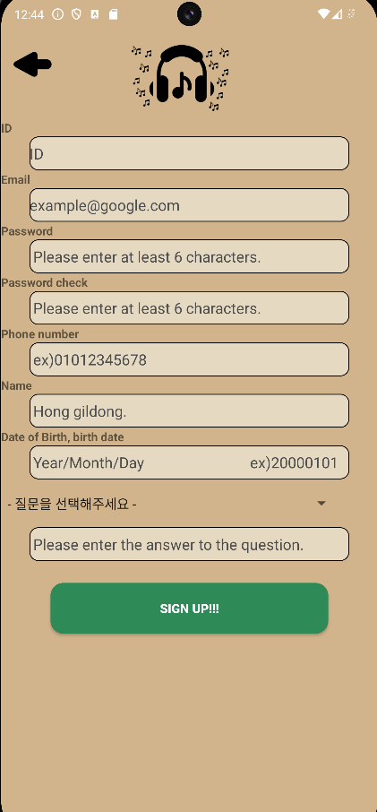
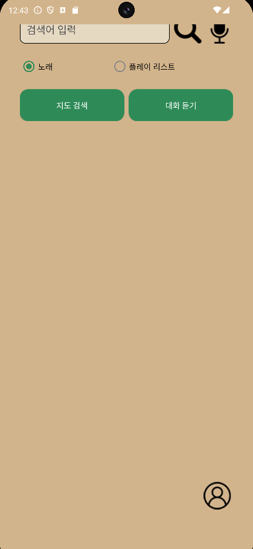
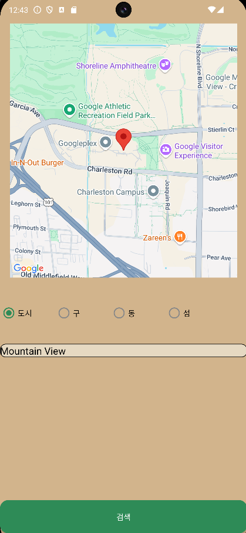
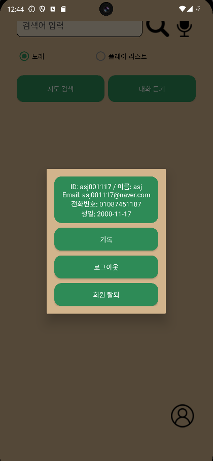
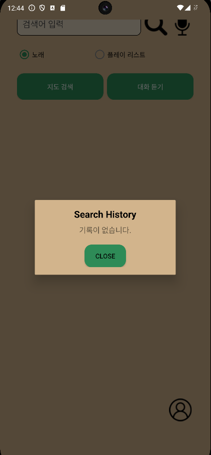
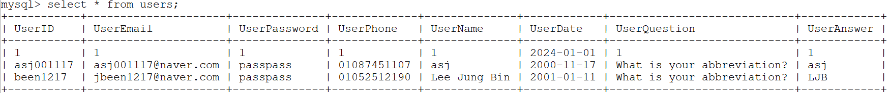
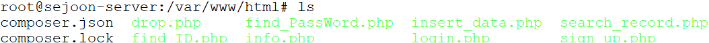

# 🎵 TuneTailor

**Appropriate Music Playback Programs Based on Human Emotions (with Spotify)**

여행, 사용자의 일상, 그리고 대화 속 감정과 상황에 맞춰 음악을 자동 재생해 주는 감성 기반 음악 추천 애플리케이션

---

## 📱 소개

**TuneTailor**는 사용자의 상호작용(대화, 위치, 환경 등)을 기반으로 감정을 분석하고, 그에 적합한 음악을 추천 및 재생해 주는 감성 음악 추천 앱입니다.

기존 AI 자동 추천 시스템과는 다르게 **사용자의 상황과 맥락**을 우선 고려하여 음악 추천을 목표로 개발하였습니다.

졸업작품 프로젝트의 일환으로 개발되었으며, 팬데믹 이후 **여행과 야외 활동이 증가하는 시대 흐름**에 맞춰, 더 개인화된 음악 경험을 제공하는 것을 목표로 합니다.

---

## 🚀 주요 기능

- 🔐 **회원 기능**
  - 로그인 / 회원가입
  - 아이디 또는 비밀번호 찾기 (이메일 / 휴대폰 번호 기반)
  - 회원 탈퇴

- 🎙️ **음성 기반 감정 인식**
  - 두 사람 간의 대화를 듣고 감정을 분석
  - 분석된 감정에 따라 적절한 음악 자동 재생

- 📍 **상황 기반 음악 추천**
  - 구글 지도를 통한 위치 및 환경 정보 수집
  - 상황(장소/날씨 등)에 맞는 음악 자동 재생

- 🎧 **음악 탐색 및 재생 기능**
  - Spotify API를 이용한 음악 및 플레이리스트 검색
  - 검색 기록 저장
  - 음악 직접 재생 기능

---

## 🛠️ Tech Stack

### ⚙️ Environment


### 🧠 Backend / Database


### 📱 Mobile Development


### 🌐 API Integration


### 💬 Communication


---

## 🎯 개발 목적

> **“AI가 아닌, 나를 아는 음악 플레이리스트”**

COVID-19 이후 여행과 야외 활동이 증가하면서, 단순한 AI 추천이 아닌
**사용자의 실시간 감정과 환경**을 반영해 음악을 추천해 주는 진짜 ‘개인 맞춤형’ 음악 앱을 만들고자 했습니다.
이러한 맥락에서 **TuneTailor**는 사용자와의 대화를 듣고, 위치를 분석하고, 감정을 이해한 뒤
당신에게 지금 가장 필요한 음악을 재생해 줍니다.

---

## 📺 화면 구성
<div align="center">
  
| 첫 화면 | 로그인 화면 |
|:--:|:--:|
|  |  |

| 아이디 찾기 | 비밀번호 찾기 |
|:--:|:--:|
|  |  |

| 회원가입 | 메인 화면 |
|:--:|:--:|
|  |  |

| 음성 인식 화면 | 지도 기반 음악 추천 |
|:--:|:--:|
|  |  |

| 회원정보 페이지 | 검색 기록 |
|:--:|:--:|
|  |  |

| 실제 DB 연동 화면 | 내부 PHP 파일 |
|:--:|:--:|
|  |  |

<div align="left">
  
---

## 📄 라이선스

본 프로젝트는 졸업 작품으로 제작되었으며, 상업적 용도나 재배포는 허가되지 않습니다.

---

## 🛠️ 아키텍처

### 디렉터리 구조
```bash
├── Flow_Chart
│   └── Graduation_work_FlowChart.png : 순서도
│
├── Graduation_work
│   ├── AndroidManifest.xml
│   │
│   ├── java
│   │   └── com
│   │        └── example
│   │            ├── AccessTokenResponse.java
│   │            ├── Artist.java
│   │            ├── GJ.java
│   │            ├── GlobalSettings.java
│   │            ├── Login.java
│   │            ├── Mainmenu.java
│   │            ├── Map_Mode.java
│   │            ├── Playlist.java
│   │            ├── PlaylistResponse.java
│   │            ├── SearchResponse.java
│   │            ├── Sign_UP.java
│   │            ├── SpotifyAuthService.java
│   │            ├── SpotifyService.java
│   │            ├── Track.java
│   │            ├── User_Find.java
│   │            ├── User_Info.java
│   │            └── first_page.java
│   │
│  res
│   ├── drawable
│   │   ├── app_logo.png
│   │   ├── btn_selector.xml
│   │   ├── color_background.xml
│   │   ├── color_background_insert.xml
│   │   ├── color_button.xml
│   │   ├── color_button_click.xml
│   │   ├── drawable
│   │   ├── ic_launcher_background.xml
│   │   ├── ic_launcher_foreground.xml
│   │   ├── icon.png
│   │   ├── icon_mike.png
│   │   ├── icon_mike_die.png
│   │   ├── icon_search.png
│   │   ├── icon_user.png
│   │   ├── left_arrow.png
│   │   └── radio_button_color.xml
│   │
│   ├── layout
│   │   ├── first_page.xml
│   │   ├── forgot_id.xml
│   │   ├── forgot_password.xml
│   │   ├── gj.xml
│   │   ├── login_page.xml
│   │   ├── mainmenu_page.xml
│   │   ├── map.xml
│   │   ├── signup_page.xml
│   │   ├── user_info.xml
│   │   ├── user_record.xml
│   │   └── user_record_info.xml
│   │  
│   └── values
│       └── signup_question_page.xml│
│
├── images
│   ├── 1_first_page.png
│   ├── 2_login.png
│   ├── 3_find_id.png
│   ├── 4_find_pw.png
│   ├── 5_signup.png
│   ├── 6.main_page.png
│   ├── 7_voice.png
│   ├── 8_map.png
│   ├── 9_user_info.png
│   ├── 10_search_history.png
│   ├── 11_db.png
│   └── 12_php.png
│
└── README.md : 리드미 파일
